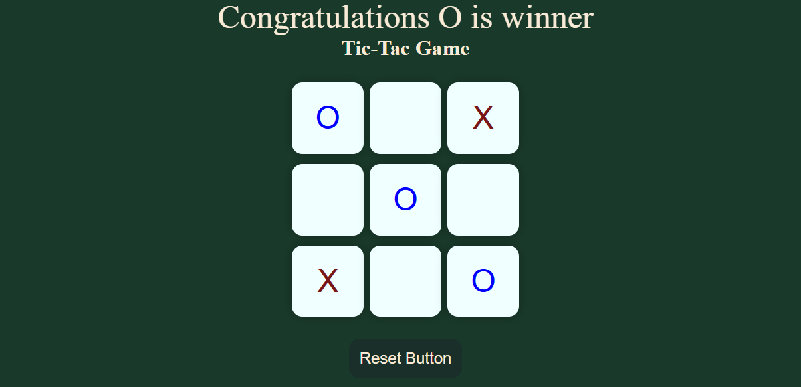

# 🎮 Tic Tac Toe Game

A simple Tic Tac Toe game built with HTML, CSS, and JavaScript. Play against a friend in this classic 3x3 grid game!

## 🚀 Live Demo
[Click here to play!](https://tic-tac-toe-game-lac-rho.vercel.app/)  


---

## 📸 Preview

  


---

## 🛠️ Technologies Used
- HTML
- CSS
- JavaScript (Vanilla)

---

## 🎯 Features
- Two-player mode
- Win detection (row, column, diagonal)
- Draw detection
- Reset game button

---

## 📂 How to Run Locally

1. Clone the repository:
```bash
git clone https://github.com/Yahyarizwan85/tic-tac-toe-game
